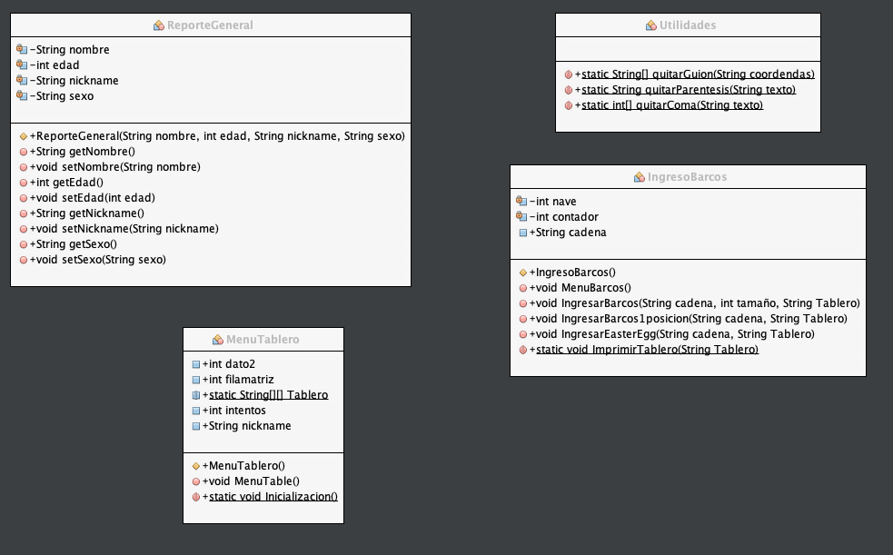

# Práctica Batlleship

BattleShip es un juego el cual consiste en desplegar una flota de barcos en un tablero de 10 filas x 10 columnas, y un contrincante disparará misiles en determinadas coordenadas para intentar adivinar la posición de alguno de los barcos de la flota. Si logra acertar en una parte de algún barco lo hunde por completo.Normalmente se juega en parejas y no se puede ver el tablero del contrincante, en nuestro caso para poner en práctica los distintos conceptos de programación definiremos nosotros mismos las posiciones de cada uno de los barcos de la flota, lanzaremos misiles y podremos ver una representación en tiempo real del estado del tablero y algunos datos importantes como la cantidad de intentos realizados y barcos hundidos. Para que sea más fácil el conteo de barcos hundidos a diferencia del juego original en este juego al tocar una casilla que es parte de algún barco automáticamente se hunde este por 
completo.

## Comenzando 🚀

_Estas instrucciones te permitirán obtener una copia del proyecto en funcionamiento en tu máquina local para propósitos de desarrollo y pruebas._

Mira **Deployment** para conocer como desplegar el proyecto.


### Requisitos 📋

```
Procesador core i5 o superios
8 GB de RAM
1.0 GB de espacio en memoria
```

### Como jugar 🔧

Pasos para ejecutar el archivo .jar para empezar a jugar 
```
Abre la consola o cmd desde la carpeta donde se encuentra el archivo .jar
A continuación coloque el comando "java -jar"
y luego el nombre dle archivo
```
por ejemplo
```
java -jar nombrejuego.jar
```

### Diagrama de clases



