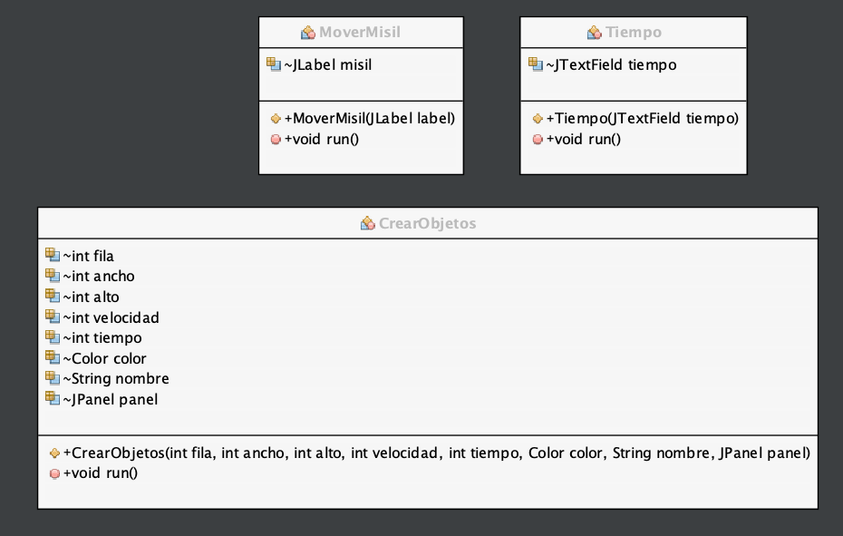
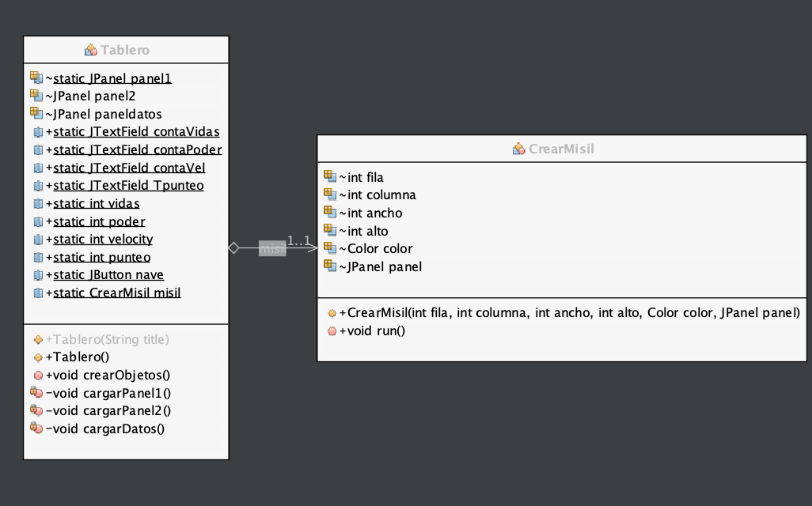
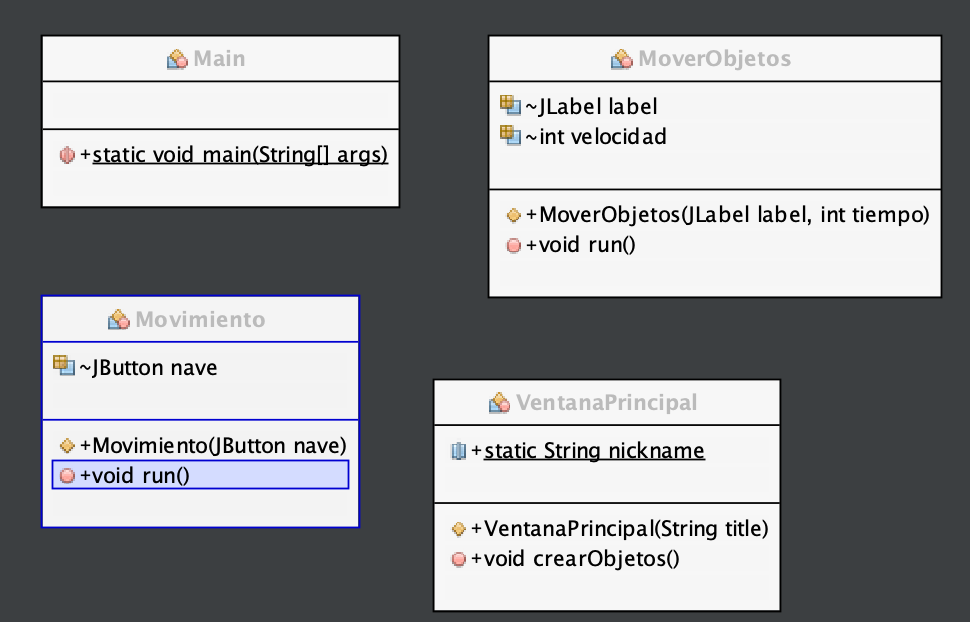

# Práctica2  GALAGA


El jugador controla una nave que debe enfrentarse contra un enjambre de distintos objetos. Cada partida tendrá una duración máxima de 4 minutos, este tiempo se mostrará en el tablero de juego en segundos y de manera regresiva. El juego consiste en intentar sobrevivir los 4 minutos de partidas y lograr la mayor puntuación posible, este juego tiene como base el famoso juego Galaga, con ciertas modificicaciones en cuanto a modo de juego ya que puedes obtener vidas y hacerte invisible

## Comenzando 🚀

_Estas instrucciones te permitirán obtener una copia del proyecto en funcionamiento en tu máquina local para propósitos de desarrollo y pruebas._

Para poder jugar a este adictivo juego primeramente debes de tener instalado java en tu computador para poder correrlo.


### Requisitos 📋

```
Procesador core i5 o superior
8 GB de RAM
1.0 GB de espacio en memoria
```

### Como jugar 🔧

Pasos para ejecutar el archivo .jar para empezar a jugar 
```
Abre la consola o cmd desde la carpeta donde se encuentra el archivo .jar
A continuación coloque el comando "java -jar"
y luego el nombre dle archivo
```
por ejemplo
```
java -jar nombrejuego.jar
```

### Diagrama de clases






