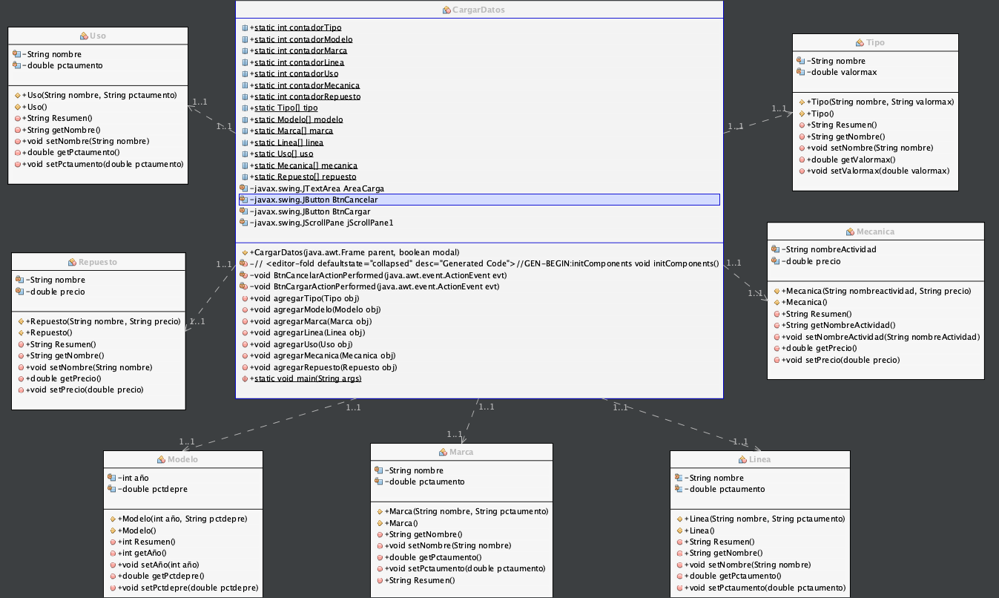
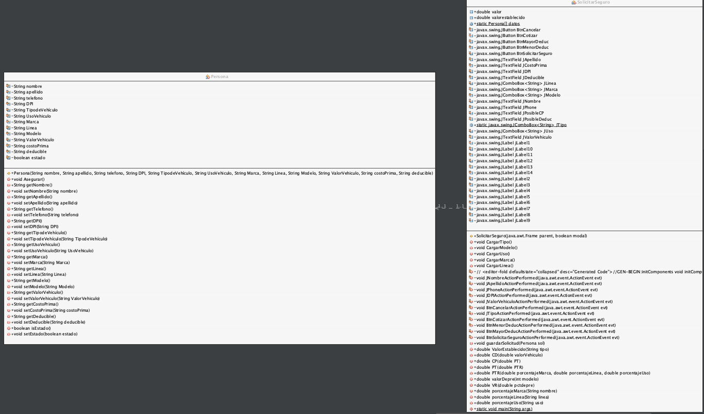
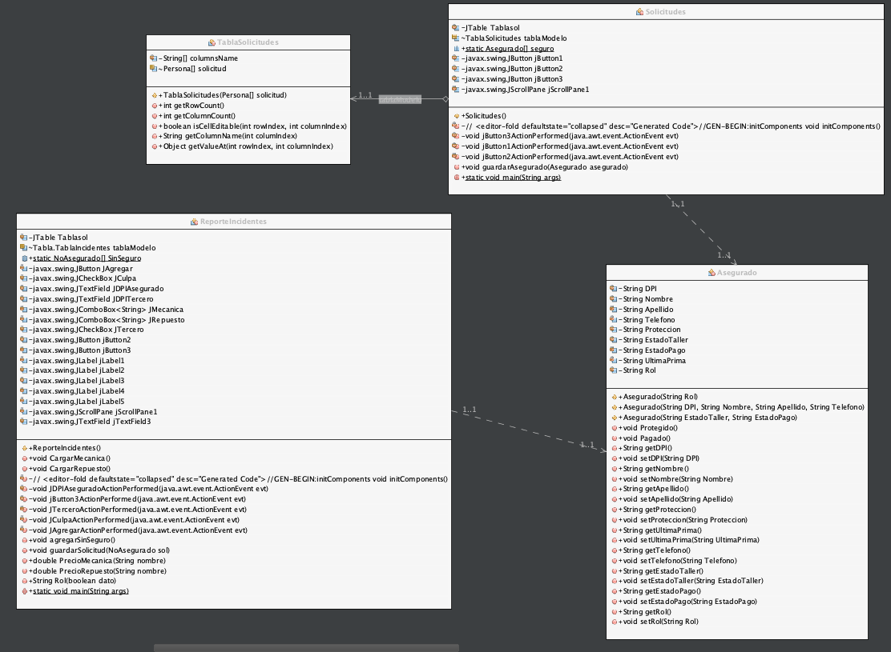
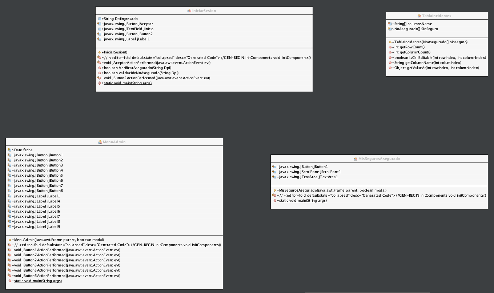
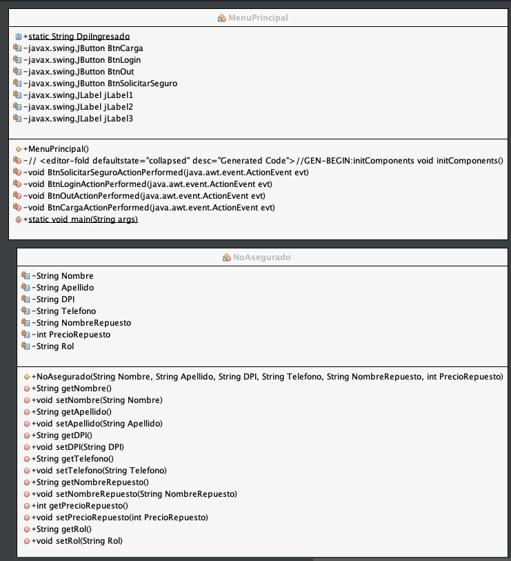
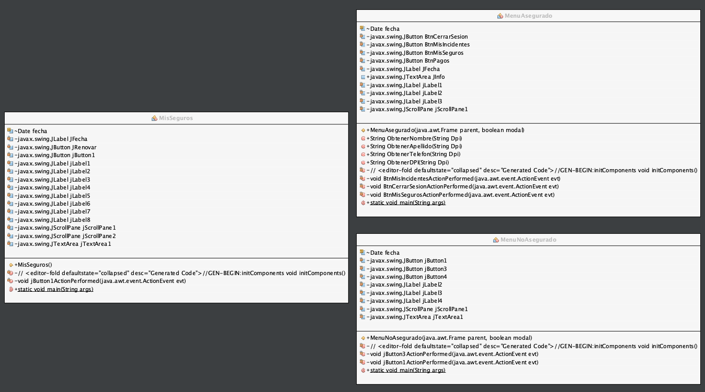

# Proyecto1 Aseguradora

## De que se trata
El banco la ceiba planea ofrecer diversos tipos de seguros para que las personas puedan tener tranquilidad y protección ante cualquier imprevisto. Su plan piloto contempla el manejo de un seguro básico:
➢ Automas: seguro para autos que cubre los gastos de los repuestos y mano de obra por 
reparación ante un accidente.

## Comenzando 🚀

_Estas instrucciones te permitirán obtener una copia del proyecto en funcionamiento en tu máquina local para propósitos de desarrollo y pruebas._

### Requisitos 📋

```
Procesador core i5 o superios
8 GB de RAM
1.0 GB de espacio en memoria
```

### Como funciona

Pasos para ejecutar el archivo .jar para empezar a jugar 
```
Abre la consola o cmd desde la carpeta donde se encuentra el archivo .jar
A continuación coloque el comando "java -jar"
y luego el nombre dle archivo
```
por ejemplo
```
java -jar nombrearchivo.jar
```

### Diagrama de clases









