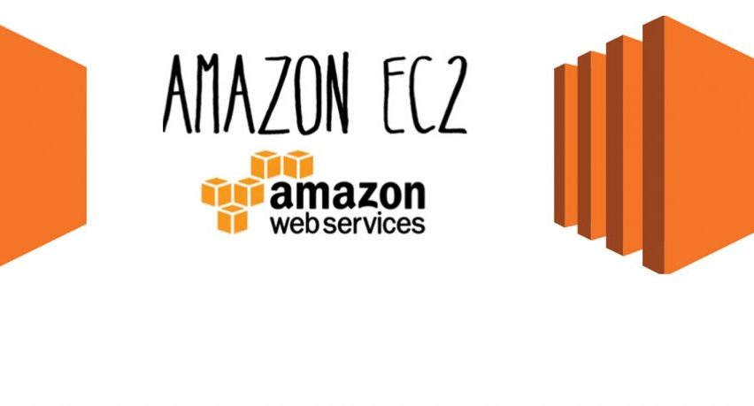
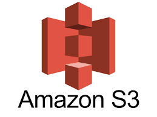

# AMAZON WEB SERVICES S3 AND EC2

Existen diferentes tipos de servicios proporcionados por Amazon pero en este ensayo hablaremos de 2 en concreto como lo son AMAZON S3 (Simple Storage Service) y AMAZON EC2 (Elastic Compute Cloud) empezaremos hablando sobre S3 este es un servicio web escalable, de alta velocidad y bajo costo diseñado para el respaldo en línea y el archivo de datos y programas de aplicaciones, este a su vez nos permite cargar, almacenar y descargar cualquier tipo de archivos de hasta 5TB de tamaño.
Este servicio permite a los suscriptores acceder a los mismos sistemas que Amazon utiliza para ejecutar sus propios sitios web. El suscriptor tiene control sobre la accesibilidad de los datos en otras palabra un acceso de tipo público o un acceso de tipo privado.

## Funciones de Amazon S3
-	Es de bajo costo y muy fácil de usar, con Amazon S3 podemos almacenar una gran cantidad de datos a muy bajo costo.
-	Es seguro, Amazon S3 nos permite la transferencia de datos a través de SSL ya que los datos se cifran automáticamente una vez que han sido cargados, de igual manera el usuario tiene el control de manera total de sus datos mediante la configuración de politicas de deposito mediante AWS IAM.
-	Es escalable, ya que con Amazon S3 no debemos de preocuparnos por los problemas de almacenamiento, porque podemos almacenar tantos datos como tengamos y acceder a ellos en cualquier momento.
-	Posee un mayor rendimineto, Amazon S3 se encuentra integrado con Amazon CloudFront, lo que permite distribuir contenido a los usuarios finales con una baja latencia y nos proporciona altas velocidades de transferencia de datos y sin ningún compromiso de uso mínimo.
-	Una de de sus mayores funciones es que se encuentra integrado con los servicios de Amazon Web Services, ya que Amazon S3 se encuentra integrado con los servicios de AWS incluyendo el ya antes mencionado Amazon CludFront, AmazonCLoudWatch, Amazon Kinesis, Amazon RD, Amazon Route 53, Amazon VPC, AWS Lambda, Amazon EBS, Amazon Dynamo DB, entre otros.

## Ahora es es turno del servicio EC2 o Elastic Compute Cloud el cual es un interfaz de servicio web que proporciona capacidad de cálculo ode tamaño variable en la nube de AWS, está diseñado para que los desarrolladores tengan un control completo sobre los recursos informaticos y de escala web.
Las instancias en EC2 se pueden cambiar de tamaño y de la misma manera la cantididad de instancias se puede ampliar o reducir según nuestros requisitos. Estas instancias a su vez pueden iniciarse en una o más ubicaciones geográficas o regiones y zonas de disponibilidad (AZ). Cada región consta de varias AZ en ubicaciones distinatas, conectadas por redes de baja ltaencia en la misma región.

## Componentes de EC2
En AWS EC2, los usuarios deben conocer los componentes de EC2, el soporte de sus sistemas operativos medidas de seguridad, estructuras de precios etc.
Entre los cuales podemos mencionar:
El soporte de sistema operativo, la seguridad, los precios, la tolerancia a fallos y la migración.

## Características de EC2
-Podemos decir que es Confiable, ya que Amazon EC2 nos ofrece un entrono altamente confiable donde le reemplazo de instancias es rápidamente posible. El compromiso del acuerdo de nivel de servicio es del 99.9% de disponibilidad para cada región de Amazon EC2.
-Es seguro ya que funciona con Amazon virtual Private Cloud para proporcionarnos una red segura y al mismo tiempo sólida de recursos.
- Posee herramientas flexibles, las herramientas para que los desarrolladores y administradoes de sistemas creen aplicaciones de fallas y se aislen de situaciones de fallos comunes.
-Por ultimo es un producto low cost ya que Amazon EC2 nos permite pagar solo por los recursos que utilizaos, incluyendo múltiples planes de compra, como instancias bajo demanda, instancias reservadas, instancis puntuales, etc. que podemos elegir según nuestro requisitos y necesidades.

